# Manual de usuario de GwaIO
Última actualización: 2022/Nov/21  
Autores: Emanuel Aguado Pérez, Juan Moraga Marín

## INDICE
- [Manual de usuario de GwaIO](#manual-de-usuario-de-gwaio)
  - [INDICE](#indice)
  - [¿Qué es GwaIO?](#qué-es-gwaio)
  - [Requisitos mínimos del sistema ](#requisitos-mínimos-del-sistema)
  - [Requisitos adicionales del sistema](#requisitos-adicionales-del-sistema)
  - [Primeros pasos](#primeros-pasos)
    - [Panel de Login ](#panel-de-login)
  - [Inicialización del proyecto](#inicialización-del-proyecto)
  - [Espacio de trabajo](#espacio-de-trabajo)
  - [Paneles principales](#paneles-principales)
    - [Panel de Tareas](#panel-de-tareas)
    - [Panel de Ficheros](#panel-de-ficheros)
    - [Barra de Menus](#barra-de-menus)
    - [Barra de Estado](#barra-de-estado)
  - [Barras de herramientas](#barras-de-herramientas)
    - [Barra de herramientas del explorador](#barra-de-herramientas-del-explorador)
    - [Barra de herramientas de sincronización](#barra-de-herramientas-de-sincronización)
    - [Barra de herramientas de reproducción](#barra-de-herramientas-de-reproducción)
    - [Barra de herramientas de SG](#barra-de-herramientas-de-sg)
  - [Paneles secundarios](#paneles-secundarios)
    - [Panel de Configuración](#panel-de-configuración)
    - [Panel de Filtrado](#panel-de-filtrado)
    - [Panel de Hilos](#panel-de-hilos)
    - [Panel de Sincronización](#panel-de-sincronización)
    - [Panel de Reproducción](#panel-de-reproducción)
    - [Panel de Notas](#panel-de-notas)
    - [Panel de Renombrado](#panel-de-renombrado)
    - [Panel de Publicado](#panel-de-publicado)
    - [Panel de Concatenar](#panel-de-concatenar)
    - [Panel de Chequeo de Estatus (Versionator)](#panel-de-chequeo-de-estatus-versionator)
    - [Panel de BDL](#panel-de-bdl)
    - [Tool Download playlist version](#tool-download-playlist-version)
  - [Buenas prácticas de uso](#buenas-prácticas-de-uso)
    - [Comenzar una tarea nueva](#comenzar-una-tarea-nueva)
    - [Finalizar una tarea](#finalizar-una-tarea)

## ¿Qué es GwaIO?
GwaIO es una herramienta que permite a sus usuarios conectar su estación de trabajo con el servidor compartido de la empresa y con la base de datos que se use para el proyecto. 

A nivel práctico, GwaIO es una aplicación que permite a los artistas ver una lista de tareas sobre las que tiene que trabajar. Además, permite fácilmente generar ficheros nuevos automatizando la nomenclatura de éstos, la recogida el input de tareas anteriores, la publicación en la base de datos de nuevas versiones etc.

## Requisitos mínimos del sistema 
Para ejecutar y utilizar GwaIO, su equipo debe cumplir con las especificaciones técnicas mínimas que se indican a continuación.  
Windows 10 de 64 bits (versión 21H2) o posterior

## Requisitos adicionales del sistema
GwaIO integra dentro de sus funcionalidades otros programas, los cuales amplían el abanico de herramientas disponibles, aunque éstos no sean necesarios, es recomendable disponer de ellos: 
* [RV](https://www.shotgridsoftware.com/rv/download/)
* [FFmpeg](https://ffmpeg.org/)

Además, si se quiere utilizar el sistema de sincronización que viene incluido con GwaIO, se deberá tener montado el recurso compartido que se utilice como carpeta raíz del proyecto. En Windows no será necesario ya que se utilizan rutas UNC, pero en Mac y Linux se debe montar el recurso raíz como disco SMB.  
En el caso de que el ordenador esté en remoto, se deberá acceder a la red a través de una VPN.

## Primeros pasos
Cuando inicias GwaIO por primera vez, eres presentado con la siguiente interfaz:  
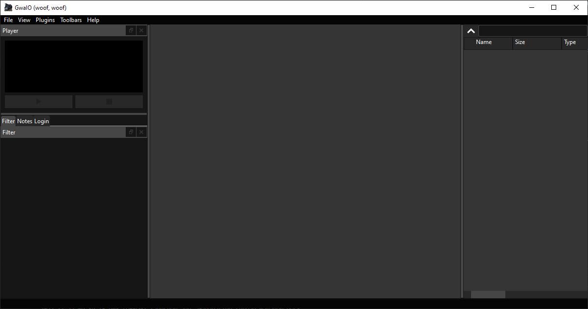   
Como es natural, no tiene ningún dato cargado todavía, ya que para poder ver datos tienes que identificarte primero en la app.

### Panel de Login 
Cuando inicias GwaIO por primera vez, no tendrás una cuenta vinculada. Para ello tienes que loguearte con la cuenta que te proporcione tu IT.  Primero tenemos que acceder al “Panel de Login”. Este panel se encuentra en la región inferior izquierda de la aplicación: 

Escriba las credenciales de usuario y contraseña para iniciar sesión. Para finalizar presione el botón aceptar. 

Una vez logueado, el estatus pasará de “not logged” a “logged”.

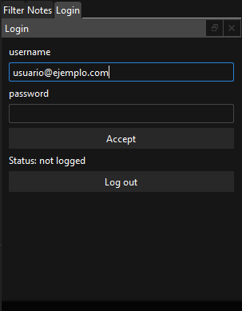

## Inicialización del proyecto 

Una vez identificado en la aplicación, ya se puede tener acceso a los proyectos instalados en GwaIO. Para cargar un proyecto, haga clic en el menú desplegable llamado “Menú de Plugins”, el cual se encuentra en la barra de menús del programa, en la parte superior de la ventana. Haga clic en el plugin del proyecto que desea cargar. 

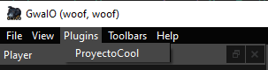

Cuando se inicializa un proyecto, el programa carga el plugin vinculado a este proyecto y a continuación carga automáticamente tanto las tareas del proyecto en el “Panel de Tareas”, como las barras de herramientas asociadas al mismo. 

## Espacio de trabajo 

La interfaz de usuario se divide en dos paneles principales, el “Panel de Tareas” y el “Panel de Ficheros”. Tiene además una “Barra de Menús” y una “Barra de Estatus”. 

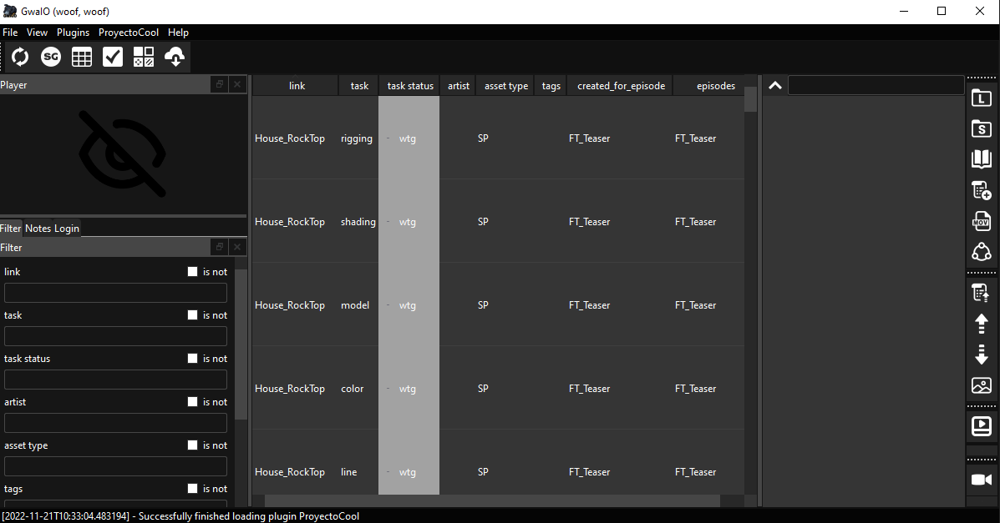

Adicionalmente tiene otros paneles y barras de herramientas secundarias que se pueden solapar entre sí, desacoplar de la ventana principal y reacoplar de nuevo, dando la posibilidad de customizar el espacio de trabajo. A continuación, vamos a verlos uno a uno. 

## Paneles principales 

### Panel de Tareas 

El “Panel de Tareas” muestra la información relativa a las tareas creadas para cada proyecto. 

Esta información se muestra en forma de tabla, donde cada tarea es una fila y cada columna son los datos con los que se puede filtrar en el “Panel de Filtros” 

Las teclas de control y shift funcionan igual que en el explorador de windows y permite seleccionar varias tareas.  

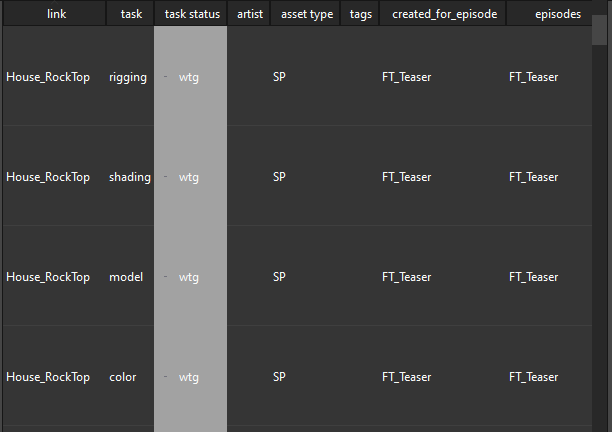

### Panel de Ficheros 

El “Panel de Ficheros” muestra los ficheros existentes para la tarea seleccionada en el “Panel de Tareas”. Si no hay ninguna tarea seleccionada, este menú se muestra vació. A continuación, se muestran dos imágenes, la primera con ninguna tarea seleccionada y la segunda con una tarea seleccionada. Si se seleccionan varias tareas, el “Panel de Ficheros” muestra la última tarea seleccionada. 

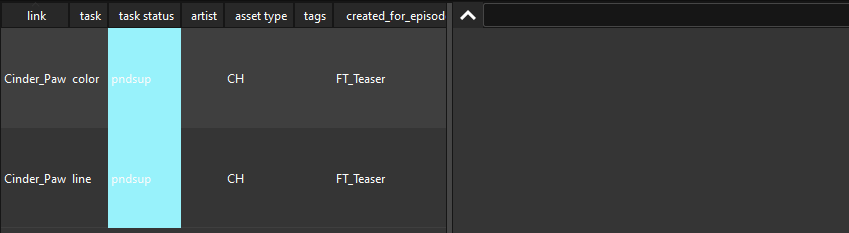  

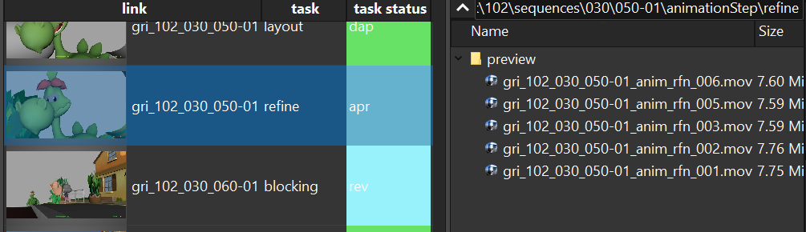

Adicionalmente el “Panel de Ficheros” tiene una barra de navegación y un botón para subir a la carpeta continente de la carpeta que se muestra actualmente. 

Si se pone una dirección válida y se pulsa la tecla “Enter”, el “Panel de Ficheros” se actualiza a la ruta escrita. 

Además, tiene funcionalidades similares a la de cualquier explorador de archivos: 

* Haga doble click para abrir un archivo 

* Presione Ctrl+Click para seleccionar varios archivos 

* Presione Alt+Click para seleccionar el conjunto de archivos comprendido entre ambos clics. 

* Arrastre un archivo dentro del panel para copiarlo dentro de la carpeta seleccionada en el explorador de ficheros 

* Seleccione y arrastre un archivo del explorador de ficheros a una ventana externa al programa para moverlo/utilizarlo. 

* Los archivos mal nombrados se muestran con el texto de color rojo. 

### Barra de Menus 

La “Barra de Menus” se sitúa en la parte superior de la aplicación y tiene la siguiente disposición: 

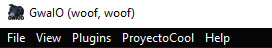

* File: contiene tres acciones: 
  * Update pipeline: Cuando haya alguna actualización de GwaIO se deberá pulsar este botón para obtenerla. 

  * Remove empty folders: Elimina directorios vacíos que existan dentro del proyecto. 

  * Run tests: Esta opción es para los desarrolladores y no tiene ningún uso práctico para el usuario. 

* View: Activa o desactiva la visibilidad de paneles 

* Plugins: Inicializa el plugin seleccionado. Solo se puede inicializar un plugin a la vez. 

* <"Nombre del Proyecto">: Activa o desactiva las "Barras de herramientas" de cada proyecto. 

* Help: Muestra el dialogo de ayuda, hasta la fecha sólo tiene un “About”. 

### Barra de Estado 

Muestra diversos mensajes dependiendo de cuál sea la última acción hecha por el artista. 

## Barras de herramientas 

Las barras de herramientas, también conocidas como “toolbars” se pueden ocultar, mostrar, desacoplar de la interfaz o mover de posición al gusto del usuario. Cada una de estas barras de herramientas contienen bonotes con funcionalidades que se describen a continuación. 

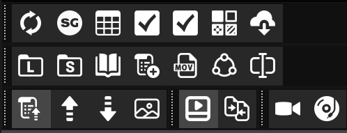

Algunas barras de herramientas (Toolbars). 

Para mostrar/ocultar las barras de herramientas, haga clic en Toolbars y/o <"Nombre del proyecto">, que se encuentra en la barra de menus, en la parte superior de la ventana, y seleccione o deseleccione las barras de herramientas que desee modificar. 

### Barra de herramientas del explorador 

| Icono        | Nombre del botón | Acción  |
| ------------ |:----------------:|:--------|
||Open local folder | Abre la carpeta local de la tarea seleccionada. Esto es, la carpeta de la tarea dentro del sistema de ficheros local del ordenador que está ejecutando la aplicación. 
||Open server folder | Abre la carpeta del server de la tarea seleccionada. Esto es, la carpeta de la tarea dentro del sistema de ficheros del servidor que está ejecutando la aplicación. Si el ordenador está en remoto, necesitará una VPN para acceder a esta carpeta. 
||Open documentation | Abre la carpeta que contiene los ficheros de la documentación. Esta carpeta suele estar en la raíz del programa y se llama “documents”. 
||Add version | Crea un nuevo fichero para la tarea seleccionada. El número de version elegido se calcula como una unidad superior a la mayor versión encontrada en el sistema de ficheros local. Tiene varias opciones:<ul><li>From selected file: Crea una nueva versión en la tarea seleccionada a partir del archivo seleccionado en el explorador de ficheros.<li>From <"extensión"> file: Crea una nueva versión en la tarea seleccionada de la extensión dada por el submenú del botón. (<"extensión"> es equivalente al formato del archivo de versión que se desee) 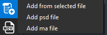 <li>Cuando no hay ningún archivo, el programa recogerá la última versión de la tarea anterior. En caso de no haber tarea anterior o esta tarea no tuviese ningún archivo, se abrirá la carpeta de “Templates” asociada a su proyecto. 
||Conversor | Cambia el formato de un archivo multimedia. Necesita tener instalado FFmpeg para que funcione. Actualmente existen dos tipos de conversión: de mp4 a mov y de gif a mov, en caso de necesitar conversiones adicionales se pueden pedir a los desarrolladores.<li>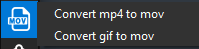
||Publish version | Abre la ventana de publicador de versiones. Para más información consulte el epígrafe de “Diálogo de Publicación”. 
||Renamer tool | Abre la ventana de renombrado de archivos. Más información bajo el epígrafe “Panel de Renombrado”. 

Tiene funcionalidades relacionas con el manejo de ficheros. Además, tiene herramientas relacionadas con la publicación de versiones dentro de una base de datos. 

### Barra de herramientas de sincronización 
Tiene funcionalidades relacionadas con la sincronización de los sistemas de ficheros local y del servidor.  

| Icono        | Nombre del botón | Acción  |
| ------------ |:----------------:|:--------|
|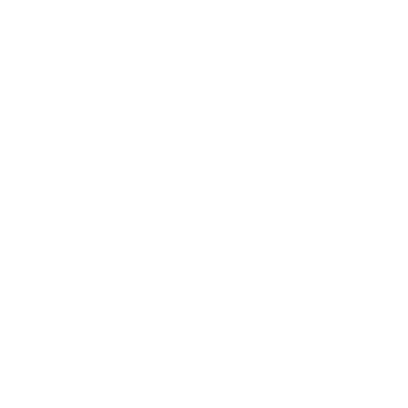|Up sync file | Sincroniza hacia el servidor los archivos seleccionados en el “Panel de ficheros”. 
||Up task sync | Sincroniza todos los archivos desde el sistema de ficheros local hacia el sistema de ficheros del servidor de las tareas seleccionadas en el “Panel de Tareas”. 
|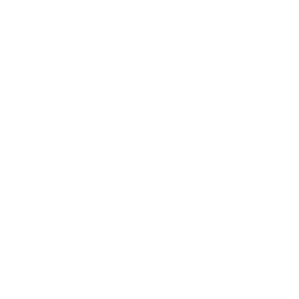|Down task sync | Sincroniza todos los archivos desde el sistema de ficheros del servidor hacia el sistema de ficheros local de las tareas seleccionadas en el “Panel de Tareas”. 
||Download thumbnail | Descarga miniaturas de las tareas seleccionadas en el “Panel de Tareas”. 

### Barra de herramientas de reproducción 
Contiene herramientas relacionadas con la visualización y comprobación de ficheros.  

| Icono        | Nombre del botón | Acción  |
| ------------ |:----------------:|:--------|
||Open in RV | Requiere tener instalado el programa RV. Permite previsualizar ficheros dentro del programa RV con distintas opciones:<ul><li>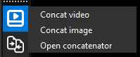<li>Concat video: Abre en RV concatenando los archivos de video seleccionados en el explorador de ficheros. Si no hay ficheros seleccionados, are en RV concatenando el ultimo fichero de video que contenga cada tarea seleccionada en el “Panel de Tareas” siempre que no haya archivos seleccionados en el explorador de ficheros.<li>Concat image: Abre en RV concatenando los archivos de imagen seleccionados en el "Panel de ficheros”, si no hay ficheros seleccionados, abre en RV concatenando el ultimo fichero de imagen que contenga cada tarea seleccionada en el “Panel de Tareas” siempre que no haya archivos seleccionados en el explorador de ficheros.<li>Open concatenator: Abre el “Panel de concatenar”.  
||Compare in RV | Requiere tener instalado el programa RV. Permite comparar ficheros dentro del programa RV con distintas opciones:<ul><li>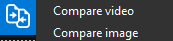<li>Compare video: Abre en RV en modo comparación los archivos de video seleccionados en el “Panel de Ficheros”. Si no hay ficheros seleccionados, abre en RV en modo comparación el ultimo fichero de video que contenga cada tarea seleccionada en el “Panel de Tareas".<li>Compare images: Abre en RV en modo comparación los archivos de imagen seleccionados en el “Panel de Ficheros”. Si no hay ficheros seleccionados, abre en RV en modo comparación el ultimo fichero de video que contenga cada tarea seleccionada en el “Panel de Tareas". 

### Barra de herramientas de SG 
Contiene funcionalidades relacionadas con Shotgrid.  

| Icono        | Nombre del botón | Acción  |
| ------------ |:----------------:|:--------|
||Refresh list of tasks | Actualiza la lista de tareas en el "Panel del Tareas". Tienes que seleccionar qué tipo de entidad quieres previsualizar: Assets, Episodes, Sequences o Shots. <li>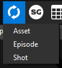
||Open task in shotgrid| Abre en el navegador de internet la página de Shotgrid de la tarea seleccionada en el “Panel de Tareas”. 
||Open Check BDL | Abre el “Panel de BDL”. 
||Open Check Version Status | Abre el “Panel de Chequeo de estatus”. 
||Open Download playlist version | Abre el “Panel de descarga de listas de reproducción”. 
||Download Versions | Descarga al sistema de ficheros local los archivos de las versiones que hay subidas a Shotgrid de las tareas seleccionadas en el “Panel de tareas”. 

## Paneles secundarios 

Los paneles secundarios muestran información adicional de las tareas y contienen herramientas de utilidad para facilitar el trabajo. 

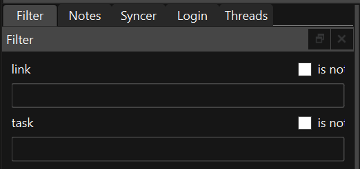  
Algunos paneles secundarios agrupados. 

Estos paneles y barras de herramientas se pueden ocultar, mostrar, agrupar o desacoplar de la interfaz o mover de posición al gusto del usuario: 

* Si desea convertir un panel en flotante, haga clic en la barra de título y arrastre el panel a otra ubicación. Otro método para desacoplar un panel de forma automática es hacer doble clic en el título del panel. 

* Si desea acoplar un panel flotante, haga clic en la barra de título del panel y arrastre hacia otro panel hacia el borde de la ventana. Otro método para acoplar un panel de forma automática es hacer doble clic sobre la barra de título del panel. 

* Para mostrar/ocultar los paneles, haga clic en View, que se encuentra en la barra de menú en la parte superior de la ventana, y seleccione o deseleccione los paneles que desee modificar. 

### Panel de Configuración 

En este panel puede ver la información de la configuración del programa. Generalmente no se debería editar directamente, ya que se edita automáticamente con el uso del propio programa. 

### Panel de Filtrado 

Permite al usuario filtrar las tareas visibles en el “Panel de Tareas”. Hay un filtro por cada columna que aparece en este panel. Los filtros se pueden combinar entre sí. Cuando un filtro este activo su campo de texto es de color azul. 

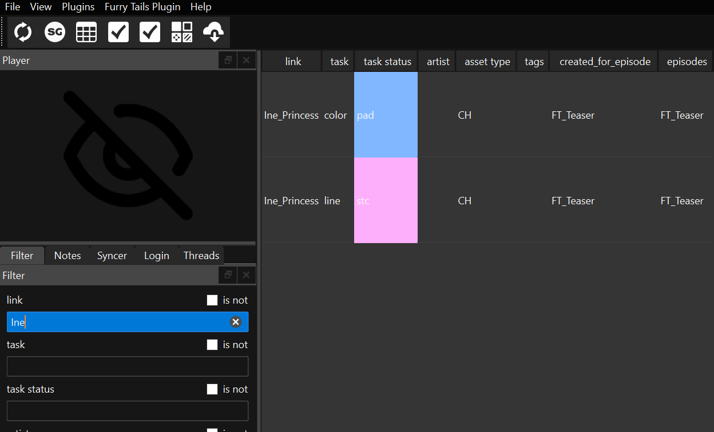 

Active la casilla “is not” para invertir el filtro. Esta acción hace que se invierta su funcionamiento y nos muestre las tareas que no contengan el texto introducido en el filtro. Esta acción cambia el color del campo del filtro a marrón. 

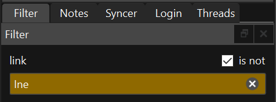  
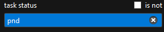 

Haga clic en el icono de la “x” situado a la derecha del filtro para borrar por completo el texto. Alternativamente también puede el usuario borrarlo manualmente con las herramientas comunes de edición de texto. 

Los filtros tienen un sistema para autocompletar. Puede añadir varios tags de filtro separándo dichos tags con el signo “;”. 

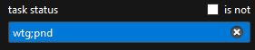 

Si el usuario activa la casilla “is not” y deja vacío el filtro, el “Panel de Tareas” no mostrará ninguna tarea. 

### Panel de Hilos 

Panel técnico donde se muestra el listado de todos los hilos de proceso abiertos, finalizados y a la espera en el programa. No es relevante para el usuario. 

 
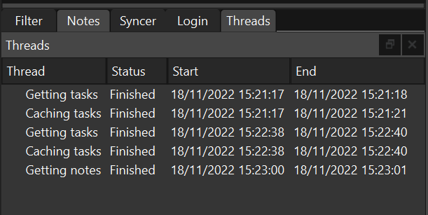 
 

### Panel de Sincronización 

Panel técnico donde se muestra el log de los archivos y carpetas sincronizadas. Además, este panel contiene los mismos botones de sincronizado de la "Barra de herramientas de sincronización". 

### Panel de Reproducción 

Reproductor y visualizador de contenido multimedia. Reproduce el último fichero seleccionado en el “Panel de Ficheros”. También reproduce la miniatura (si la hay en el sistema de ficheros local) de la última tarea seleccionada. 

### Panel de Notas 

Panel que recoge todas las notas que contenga la tarea seleccionada en el “Panel de Tareas”. Haga clic en una nota o imagen para abrirla en el navegador web. Adicionalmente, en la parte superior del panel se muestra la descripción de la tarea, si la tiene. 

### Panel de Renombrado 

Herramienta de renombrado de archivos en lote. Para añadir o quitar archivos del lote que se va a procesar en la herramienta seleccione o deseleccione los archivos que desee en el panel del explorador de ficheros. 

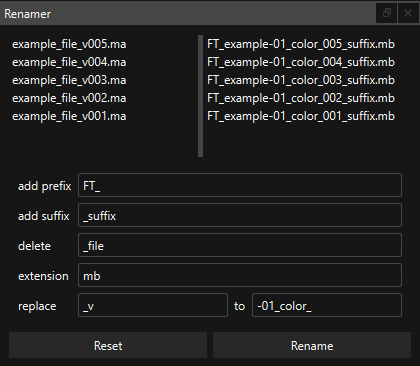  

* Prefix: Añade el texto escrito en este campo al comienzo del nombre de todos los archivos seleccionados. 

* Suffix: Añade el texto escrito en este campo al final del nombre de todos los archivos seleccionados. 

* Delete: Elimina del nombre de los archivos seleccionados el texto escrito en el campo. 

* Replace: Reemplaza del nombre de los archivos seleccionados el texto introducido en el campo de la izquierda por el texto introducido en el campo de la derecha. 

* Extension: Reemplaza la extensión de los archivos seleccionados por la que se escribe en el campo. 

### Panel de Publicado 

Herramienta para publicar nuevas versiones en la base de datos del plugin. Adicionalmente trata de sincronizar los archivos locales con los del servidor. 

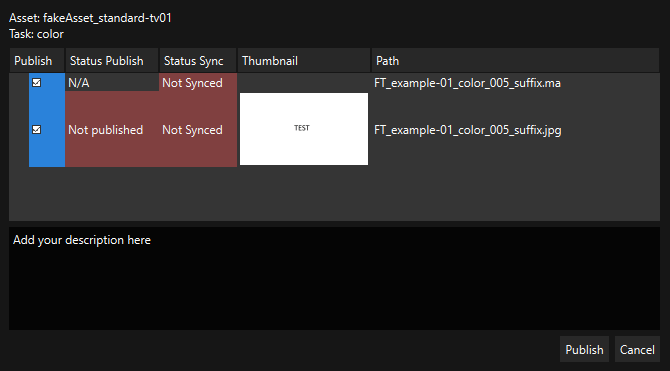 

Existen dos formas de ejecutar la herramienta: 

* Para publicar archivos específicos de una tarea siga estos pasos: 

  * Antes de abrir la herramienta, seleccione los ficheros a publicar en el “Panel de ficheros”. 

  * Después abra la herramienta 

* Para publicar archivos de varias tareas siga estos pasos: 

  * Antes de abrir la herramienta, seleccione la tarea a publicar en el “Panel de tareas”. Después abra la herramienta. 

Una vez abierta la herramienta, se mostrarán los ficheros que se van a publicar. Esta herramienta muestra distintos campos de información: 

* En la parte superior se detalla la información de la tarea en la que se va a publicar los ficheros seleccionados. 

* Publish: Checkbox para activar o desactivar la publicación de un fichero. Si la casilla está activa, el color del campo es azul y el archivo se publicará. Si la casilla está desactivada, el color del campo es blanco y el archivo no se publicará. 

* Status Publish: Estado actual de la publicación del archivo.  

  * “Publish succesful” indica que el archivo ya ha sido publicado. Los archivos publicados no se pueden volver a publicar. 

  * “N/A” indica que el archivo no es compatible para ser publicado. 

  * “Not published” indica que el archivo no ha sido publicado anteriormente. 

* Status Sync: Estado actual de la sincronización del archivo.  

  * “Not Synced” indica que el archivo no ha sido sincronizado en el servidor. 

  * “Sync succesful” indica que el archivo ya se encuentra sincronizado en el servidor. 

* Thumbnail: previsualización del archivo a publicar. 

* Path: Nombre del archivo a publicar. 

* En la parte inferior añada la descripción que desee para su versión. 

* Presione el botón “Publish” para publicar. Al finalizar el proceso, la ventana se cerrará automáticamente. 

> NOTA: esta herramienta requiere de acceso a su servidor y de conexión a internet para su correcto funcionamiento. Por favor, asegúrese de que cumple estos requisitos para su uso. 

> NOTA: los archivos publicados no se pueden volver a publicar. 

### Panel de Concatenar 

Herramienta para concatenar múltiples archivos multimedia en un único archivo de video. 

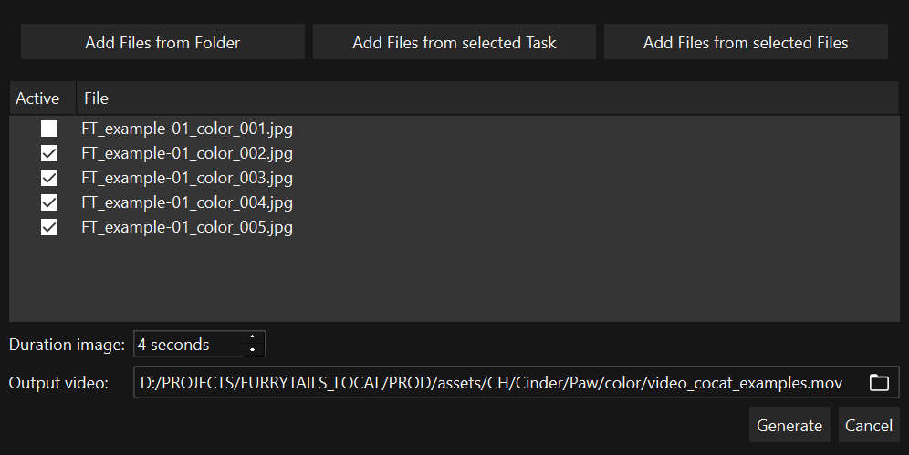

Para añadir los archivos con los que la herramienta va a trabajar, haga clic en uno de los tres métodos que se encuentran en la parte superior de la ventana. 

* Add Files from Folder: Abre una ventana de selección de carpetas. Añade los archivos que contiene las carpetas seleccionadas en la anterior ventana. 

* Add Files from selected Task: Añade todos los archivos que contenga la tarea seleccionada en el panel de Tareas. 

* Add Files from selected Files: Añade todos los archivos seleccionados en el panel de explorador de ficheros. 

El panel central de la herramienta se compone de dos columnas. La primera muestra un checkbox para activar o desactivar su uso en el proceso de concatenado. Si el checkbox está activo en el archivo, la herramienta usara el fichero. En cambio, si el checkbox está desactivado, la herramienta omitirá el archivo durante el proceso de concatenado.  

La segunda columna del panel central de la herramienta muestra el nombre de los ficheros importados. 

En la parte inferior del panel encontramos dos opciones: 

* Duration image: Seleccione los segundos que desee que dure las imágenes estáticas en el video concatenado. 

* Output video: Inserte la ruta y nombre de la salida del video final. Haga clic en la carpeta para navegar por el explorador de archivos y seleccionar la carpeta de salida. 

Por último, presione el botón generar para empezar el proceso de creación del video. 

### Panel de Chequeo de Estatus (Versionator) 

Herramienta destinada a la comprobación y resolución de no coincidencia entre el status de versiones y su tarea en Shotgrid.  

Una vez abierta la herramienta, se realiza el proceso de comprobación de todas las versiones y tareas que compongan el proyecto. Al finalizar el proceso se mostrará en pantalla todas las últimas versiones de cada tarea. 

En la interfaz de la herramienta nos encontramos lo siguiente: 

* La parte superior se compone por los botones de uso: 

  * Refresh versions: Actualiza los datos del panel central. 

  * Update all: Actualiza en Shotgrid todos los status de las tareas que no tengan el mismo status que su última versión publicada. 

  * Update select: Actualiza todos los status de las tareas seleccionadas en el panel central que no tengan el mismo status que su última versión publicada. 

  * Open in SG: Abre en el navegador web la página de la tarea de Shotgrid asociada a la versión seleccionada. 

* En la parte central se muestra el panel que contiene todos los datos de las versiones del proyecto. 

  * Match: “to fix” indica que esa versión es la última de su tarea y no coinciden sus status; “correct” indica que tanto la última versión como su tarea coinciden en status. 

* A la izquierda de la ventana tenemos en menú de filtrado. Realice filtraciones de las versiones en el panel central con los filtros. Cada una de las columnas del panel central tiene un filtro especifico. Los filtros se pueden combinar entre sí. Cuando un filtro este activo su campo de texto es de color azul.  

Chequee “is not” para invertir el filtro, esta acción hace que se invierta su funcionamiento y nos muestre las tareas que no contengan el texto introducido en el filtro. Esta acción cambia el color del campo del filtro a marrón. 

Haga clic en la X del filtro para borrar por completo el texto o bórrelo manualmente con las herramientas comunes de edición de texto. 

### Panel de BDL 

Herramienta para la creación por lotes de assets dada una BDL en Shotgrid. 

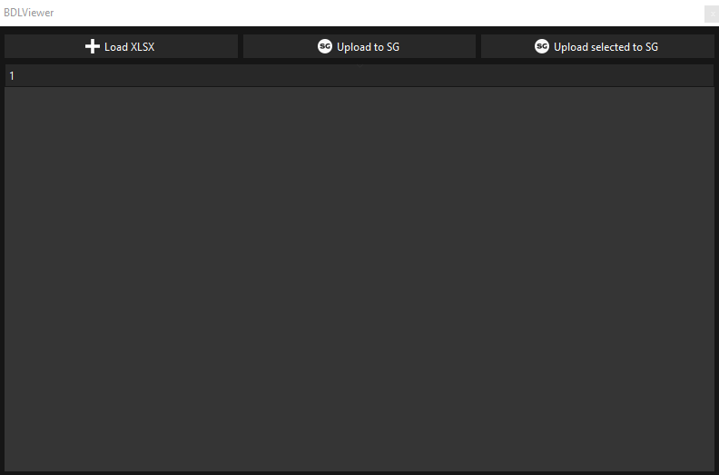

Este panel tiene 3 botones: 

* Load XLSX: te permite cargar un archivo xlsx que siga el patron para el cual ha sido diseñado el plugin de proyecto. Cuando se carga la BDL, aparece una lista con los assets que se van a crear. 

  * 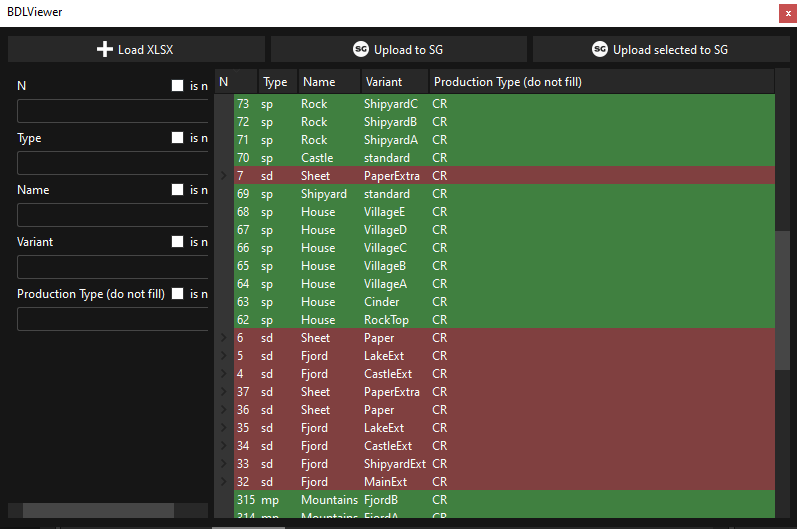

  * Las filas en verde indican que ya han sido creados y que existen en la base de datos. 
  * 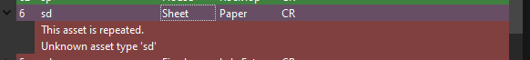
  * Las filas en rojo indican que hay algún tipo de problema, haciendo doble clic en la fila, se indica que problema hay: 

 

  * Para subsanarlo se tiene que eliminar este fallo de la BDL (xlsx) y cargarlo de nuevo. 

* Upload to SG: sube los assets que no estén ni en rojo ni en verde a la base de datos. 

* Upload selected to SG: sube los assets seleccionados y que no estén ni en rojo ni en verde a la base de datos. 

> Nota: Los assets que estén en verde y que se intenten subir actualizarán algunos datos, en el caso de que se aplique y en el case de que algunos datos no sean iguales en el XLSX y en la base de datos. Generalmente esto se aplica a la columna de Description. 

### Tool Download playlist version 

Herramienta para descargar los archivos de las versiones que contenga una Playlist de Shotgrid. 

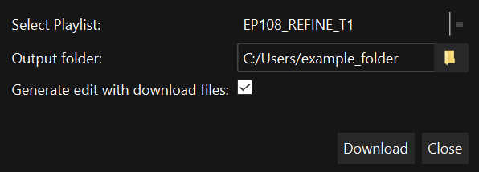

1. Select Playlist: Seleccione la playlist de la que quiere descargar las versiones. 

2. Output folder: Seleccione la carpeta donde quiera guardar los archivos de la descarga. 

3. Generate edit with download files: Seleccione esta opción si desea hacer un video concatenando todos los archivos descargados. 

4. Haga clic en el botón “Download” para comenzar el proceso 

## Buenas prácticas de uso 

Asegúrese de tener acceso a internet y a su servidor para el correcto funcionamiento del programa. En caso contrario, puede sufrir limitaciones de uso en las utilidades de GwaIO e incluso mal funcionamiento de algunas herramientas. 

### Comenzar una tarea nueva 

Cuando comience una tarea nueva, asegúrese de que dispone en su sistema local de la última versión que exista en el servidor. Para ello, seleccione la tarea correspondiente en el panel de tareas y haga clic en el botón “Down task sync” que se encuentra en la Toolbar de sincronizado.  

* Si al finalizar el proceso de sincronizado obtiene un fichero de versión, seleccione el archivo deseado y vaya a la Toolbar del explorador de ficheros y haga clic en el botón -> “Add version > From selected file”. 

* Si al finalizar el proceso de sincronizado no obtiene ningún fichero de versión, vaya a la Toolbar del explorador de ficheros y haga clic en el botón -> “Add version > From <"extensión"> file” (<"extensión"> es equivalente al formato del archivo de versión que desee). Realizando esta acción se asegurará de generar una versión base con la que empezar a trabajar a partir del último archivo generado en la tarea anterior. En caso de que no exista una versión previa o tarea previa, seleccione la “Template” idónea para su tarea en la ventana de selección que se abre cuando se da este caso. 

### Finalizar una tarea 

Al finalizar una tarea, asegúrese de sincronizar todos los archivos en su servidor y publicar la nueva versión correspondiente en Shotgrid. Para realizar esta acción de una manera idónea, se recomienda seguir estos pasos: 

1. Seleccione la Tarea finalizada en el panel de tareas. 

2. Seleccione todos los archivos nuevos que desee sincronizar en el servidor y publicar en Shotgrid. 

3. Utilice la Tool de publicado para publicar y sincronizar estos ficheros. 

4. Adicionalmente, puede sincronizar todos los ficheros en su servidor que no haya introducido en la Tool de publicado haciendo clic en el botón “Up task sync”, que se encuentra en la Toolbar de sincronizado. Si únicamente desea sincronizar archivos específicos, seleccione los archivos específicos en el explorador de ficheros y haga clic en “Up sync file”, que se encuentra en la Toolbar de sincronizado. 