# Manual de usuario de GwaIO
Última actualización: 2022/Nov/21  
Autores: Emanuel Aguado Pérez, Juan Moraga Marín

## Índice
- [Manual de usuario de GwaIO](#manual-de-usuario-de-gwaio)
  - [Índice](#índice)
  - [¿Qué es GwaIO?](#qué-es-gwaio)
  - [Requisitos mínimos del sistema ](#requisitos-mínimos-del-sistema)
  - [Requisitos adicionales del sistema](#requisitos-adicionales-del-sistema)
  - [Primeros pasos](#primeros-pasos)
    - [Ficheros de configuración](#ficheros-de-configuración)
    - [Panel de Login ](#panel-de-login)
  - [Inicialización del proyecto](#inicialización-del-proyecto)
  - [Espacio de trabajo](#espacio-de-trabajo)
  - [Paneles principales](#paneles-principales)
    - [Panel de Tareas](#panel-de-tareas)
    - [Panel de Ficheros](#panel-de-ficheros)
      - [Funciones adicionales](#funciones-adicionales)
    - [Barra de Menus](#barra-de-menus)
    - [Barra de Estado](#barra-de-estado)
  - [Barras de herramientas](#barras-de-herramientas)
    - [Barra de herramientas del explorador](#barra-de-herramientas-del-explorador)
    - [Barra de herramientas de sincronización](#barra-de-herramientas-de-sincronización)
    - [Barra de herramientas de reproducción (Obsoleto)](#barra-de-herramientas-de-reproducción-obsoleto)
    - [Barra de herramientas de SG](#barra-de-herramientas-de-sg)
  - [Paneles secundarios](#paneles-secundarios)
    - [Panel de Configuración](#panel-de-configuración)
    - [Panel de Filtrado](#panel-de-filtrado)
    - [Panel de Hilos](#panel-de-hilos)
    - [Panel de Sincronización](#panel-de-sincronización)
    - [Panel de Reproducción](#panel-de-reproducción)
    - [Panel de syncronizado](#panel-de-syncronizado)
    - [Panel de Notas](#panel-de-notas)
    - [Panel de Versiones](#panel-de-versiones)
    - [Panel de Renombrado](#panel-de-renombrado)
    - [Panel de Publicado](#panel-de-publicado)
    - [Panel de Concatenar (Obsoleto)](#panel-de-concatenar-obsoleto)
    - [Panel de BDL](#panel-de-bdl)
    - [Panel de EDL](#panel-de-edl)
    - [Panel de Timelog](#panel-de-timelog)
    - [Tool Download playlist version](#tool-download-playlist-version)
    - [Tool Download Package](#tool-download-package)
    - [Tool Job Manager (Experimental)](#tool-job-manager-experimental)
    - [Tool Broker (Experimental)](#tool-broker-experimental)
    - [Toolbar de Jobs](#toolbar-de-jobs)
    - [Tool Launch Job](#tool-launch-job)
  - [Buenas prácticas de uso](#buenas-prácticas-de-uso)
    - [Comenzar una tarea nueva](#comenzar-una-tarea-nueva)
    - [Finalizar una tarea](#finalizar-una-tarea)

## ¿Qué es GwaIO?

GwaIO es una aplicación de escritorio que agiliza y simplifica la producción de una obra audiovisual mediante el uso de diversas automatizaciones.  

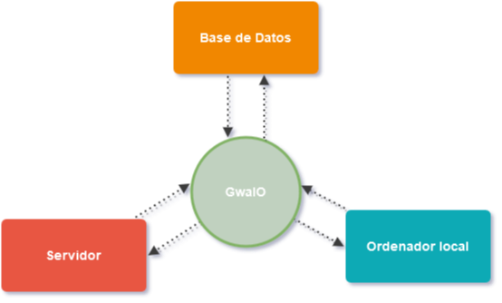 

GwaIO conecta la estación de trabajo de sus usuarios con el servidor compartido y con la base de datos que se use para el proyecto, esto por un lado permite al usuario trabajar más rápido, ya que simplifica su flujo de trabajo minimizando el error humano y haciendo más fácil sus tareas cotidianas como, por ejemplo, la creación de ficheros siguiendo una convención de nombres, la subida de su trabajo a un servidor y a una base de datos, la exportación y guardado de ficheros etc.  
Por otro lado, facilita un control de la producción, ya que se asegura de que todos el material producido esté correctamente guardado según el estándar establecido.  Finalmente, contiene diversas utilidades que, de lo contrario, requerirían software externo, reduciendo costes, como por ejemplo una herramienta para sincronizar ficheros entre un servidor externo y un ordenador local.

A nivel práctico, GwaIO es una aplicación que muestra a los artistas una lista de tareas sobre las que tiene que trabajar. Además, permite fácilmente generar ficheros nuevos automatizando la nomenclatura de éstos, la recogida del material de entrada resultados de tareas anteriores, la publicación en la base de datos de nuevas versiones etc.  
A lo largo de esta documentación veremos esto en mayor detalle.

## Requisitos mínimos del sistema 
Para ejecutar y utilizar GwaIO, el equipo donde esté instalado debe cumplir con las especificaciones técnicas mínimas que se indican a continuación:  
* Windows 10 de 64 bits (versión 21H2) o posterior

## Requisitos adicionales del sistema
GwaIO integra dentro de sí funcionalidades de otros programas, los cuales amplían el abanico de herramientas disponibles, aunque éstas no sean necesarias, es recomendable disponer de los siguientes programas para obtener sus las funcionalidades adicionales: 
* [RV](https://www.shotgridsoftware.com/rv/download/)
* [FFmpeg](https://ffmpeg.org/)

Además, si se quiere utilizar el sistema de sincronización que viene incluido con GwaIO, se deberá tener montado el recurso compartido que se utilice como carpeta raíz del proyecto. En Windows no será necesario ya que se utilizan rutas UNC, pero en Mac y Linux se debe montar el recurso raíz como disco Samba (SMB).  
En el caso de que el ordenador esté en remoto, se deberá acceder a la red a través de una VPN.

## Primeros pasos
GwaIO se distribuye con un instalador. Haciendo doble click sobre el instalador se abrirá la interfaz de instalación del programa:
GwaIO se distribuye como una carpeta comprimida dentro de un fichero zip. Dentro de esta carpeta encontramos un archivo ".exe", el cual ejecuta el programa:

 

Deberá seguir los pasos del instalador para disponer del programa. Una vez finalizada la instalación, se podrá abrir GwaIO desde la carpeta de instalación, o desde el acceso directo creado en el escritorio (Si se habilitó la opción en la instalación). 

Cuando inicias GwaIO por primera vez, eres presentado con la siguiente interfaz:  

Como es natural, no tiene ningún dato cargado todavía, ya que para poder ver datos tienes que identificarte primero en la app.

### Ficheros de configuración
Actualmente GwaIO actualiza automáticamente dos ficheros que se encuentran en la ruta "%appdata%\GwaIO". Si no existen, se generaran automáticamente. Estos dos archivos son:
* **./gwaio.env**: contiene variables de entorno que GwaIO lee y modifica a través de una interfaz de fácil uso para el usuario. Este fichero puede ser modificado a mano si hace falta.
* **./usercfg.json**: contiene datos relativos a la sesion de usuario, como por ejemplo:
  * Últimos filtros utilizados en el **"Panel de Filtros"**
  * Último username y contraseña utilizados en el **Panel de Login**. Nota: la contraseña que se guarda está encriptada, de tal manera que abriendo éste fichero no revela ningún dato confidencial.
  * Último plugin utilizado. 

### Panel de Login 
Lo normal es que al principio no tengas una cuenta vinculada a GwaIO. Para ello tienes que loguearte con la cuenta que te proporcione tu empresa.
1. Primero tenemos que acceder al **"Panel de Login"**. Este panel se encuentra en la región inferior izquierda de la aplicación.
2. Segundo Escriba las credenciales de usuario y contraseña para iniciar sesión.
3. Para finalizar presione el botón "Log in".
4. Una vez logueado, el estatus pasará de "not logged" a "logged".

GwaIO tratará de recordar tus credenciales para sesiones sucesivas.

## Inicialización del proyecto 
Una vez identificado como usuario en la aplicación, ya se puede tener acceso a los proyectos instalados en GwaIO. Para cargar un proyecto, haga clic en el menú desplegable llamado **"Menú de Plugins"**, el cual se encuentra en la **"Barra de Menús"** del programa, en la parte superior de la ventana principal. Haga clic en el plugin del proyecto que desea cargar. 

Cuando se inicializa un proyecto, el programa carga el plugin vinculado a este proyecto y a continuación carga automáticamente tanto las tareas del proyecto en el **"Panel de Tareas"**, como las barras de herramientas asociadas al mismo. 

## Espacio de trabajo 

La interfaz de usuario se divide en dos paneles principales, el **"Panel de Tareas"** y el **"Panel de Ficheros"**. Tiene además una **"Barra de Menús"** y una **"Barra de Estatus"**. 

Adicionalmente tiene otros paneles y barras de herramientas secundarias con funcionalidades adicionales que se pueden solapar entre sí, desacoplar de la ventana principal y reacoplar de nuevo, dando la posibilidad de customizar el espacio de trabajo. A continuación, vamos a verlas una a una. 

## Paneles principales 

### Panel de Tareas 

El **"Panel de Tareas"** muestra la información relativa a las tareas creadas para cada proyecto.   
Esta información se muestra en forma de tabla, donde cada tarea es una fila y cada columna son los datos con los que se pueden filtrar las tareas con los filtros que hay en el **"Panel de Filtros"**.  
Las teclas de control y shift funcionan igual que en el explorador de windows y permite seleccionar varias tareas.  

Además, tenemos la funcionalidad de poder usar un buscador rápido utilizando el atajo de teclado Ctrl+F sobre el panel de tareas.

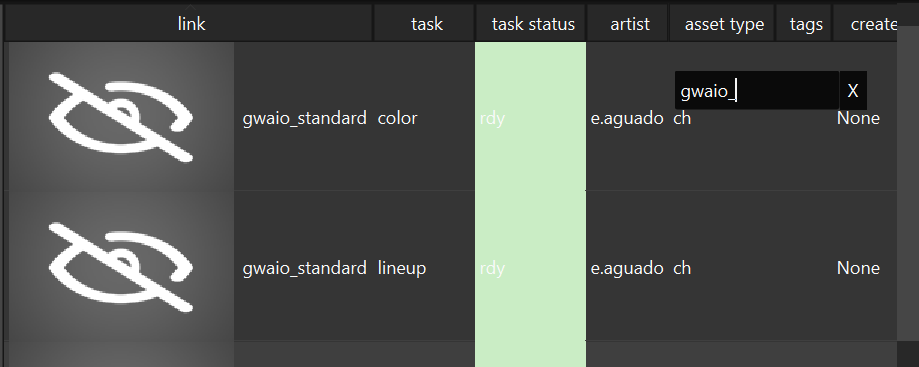

### Panel de Ficheros 

El **"Panel de Ficheros"** muestra los ficheros existentes en el sistema de ficheros local para la tarea que haya seleccionada en el **"Panel de Tareas"**. Si no hay ninguna tarea seleccionada, este menú  muestra el sistema de ficheros de la última task seleccionada (o vacío en el caso de que no se hubiera seleccionado ninguna tarea aún en la sesión activa). A continuación, se muestran dos imágenes:
 * La primera imagen muestra el **"Panel de Ficheros"** con ninguna tarea seleccionada

  

 * La segunda imagen muestra el **"Panel de Ficheros"** con una tarea seleccionada. Si se seleccionan varias tareas, el **"Panel de Ficheros"** muestra la última tarea seleccionada. 

Adicionalmente el **"Panel de Ficheros"** tiene una barra de navegación y tres botones:
 * Subir: Este boton nos lleva a la carpeta padre del path actual.
 * Refrescar: Fuerza un refrescado de los datos que hay en el panel.
 * Renombrar: Herramienta para renombrar un archivo seleccionado.

Si se pone una dirección válida y se pulsa la tecla **"Enter"**, el **"Panel de Ficheros"** se actualiza a la ruta escrita. 

#### Funciones adicionales
Este panel tiene funcionalidades similares a la de cualquier explorador de archivos:  
1. Haga doble click para abrir un archivo
2. Presione Ctrl+Click para seleccionar varios archivos 
3. Presione Alt+Click para seleccionar el conjunto de archivos comprendido entre ambos clics. 
4. Arrastre un archivo dentro del panel para copiarlo dentro de la carpeta seleccionada en el explorador de ficheros 
5. Seleccione y arrastre un archivo del explorador de ficheros a una ventana externa al programa para moverlo/utilizarlo. 
6. Los archivos mal nombrados se muestran con el texto de color rojo. 

### Barra de Menus 

La **"Barra de Menus"** se sitúa en la parte superior de la aplicación y tiene la siguiente disposición: 

* **File**: contiene tres acciones: 
  * **Update GwaIO**: cuando haya alguna actualización de GwaIO se deberá pulsar este botón para obtenerla. 
  * **Remove empty folders**: elimina directorios vacíos que existan dentro del proyecto. 
  * **Manage enviroments**: abre una ventana para editar las variables de entorno de los proyectos. 
* **View**: activa o desactiva la visibilidad de paneles. 
* **Plugins**: inicializa el plugin seleccionado. Solo se puede inicializar un plugin a la vez. 
* **<"Nombre del Proyecto">**: activa o desactiva las "Barras de herramientas" de cada proyecto. 
* **Apps**: abre aplicaciones de trabajo desde GwaIO. 
* **Help**: muestra el dialogo de ayuda, hasta la fecha sólo tiene un "About". 

### Barra de Estado 

Muestra diversos mensajes dependiendo de cuál sea la última acción hecha por el artista. 
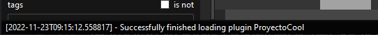

## Barras de herramientas 
Las barras de herramientas, también conocidas como **"toolbars"** se pueden ocultar, mostrar, desacoplar de la interfaz o mover de posición al gusto del usuario. Cada una de estas barras de herramientas contienen bonotes con funcionalidades que se describen a continuación. 

Algunas barras de herramientas (Toolbars). 

Para mostrar u ocultar las barras de herramientas, haga clic en **"Toolbars"** y/o **<"Nombre del proyecto">**, que se encuentra en la barra de menus, en la parte superior de la ventana, y seleccione o deseleccione las barras de herramientas que desee modificar. 

### Barra de herramientas del explorador 

| Icono        | Nombre del botón | Acción  |
| ------------ |:----------------:|:--------|
||Open local folder | Abre la carpeta local de la tarea seleccionada. Esto es, la carpeta de la tarea dentro del sistema de ficheros local del ordenador que está ejecutando la aplicación. 
||Open server folder | Abre la carpeta del servidor de la tarea seleccionada. Esto es, la carpeta de la tarea dentro del sistema de ficheros del servidor que está ejecutando la aplicación. Si el ordenador está en remoto, necesitará una VPN para acceder a esta carpeta. 
||Add version | Crea un nuevo fichero para la tarea seleccionada. El número de version elegido se calcula como una unidad superior a la mayor versión encontrada en el sistema de ficheros local. Tiene varias opciones:  <ul><li><li>**From selected file:** Crea una nueva versión en la tarea seleccionada a partir del archivo seleccionado en el explorador de ficheros.<li>**From <"extensión"> file:** Crea una nueva versión en la tarea seleccionada de la extensión dada por el submenú del botón. (<"extensión"> es equivalente al formato del archivo de versión que se desee)  <li>Cuando no hay ningún archivo, el programa recogerá la última versión de la tarea anterior. En caso de no haber tarea anterior o esta tarea no tuviese ningún archivo, se abrirá la carpeta de "Templates" asociada a su proyecto. 
||Publish version | Abre la ventana de publicador de versiones. Para más información consulte el epígrafe de **"Diálogo de Publicación"**. 

Tiene funcionalidades relacionadas con el manejo de ficheros. Además, tiene herramientas relacionadas con la publicación de versiones dentro de una base de datos. 

### Barra de herramientas de sincronización 
Tiene funcionalidades relacionadas con la sincronización de los sistemas de ficheros local y del servidor.  

| Icono        | Nombre del botón | Acción  |
| ------------ |:----------------:|:--------|
||Up task sync | Sincroniza todos los archivos desde el sistema de ficheros local hacia el sistema de ficheros del servidor de las tareas seleccionadas en el **"Panel de Tareas"** o sincroniza unicamente los ficheros seleccionados en el **Panel de ficheros**. 
||Down task sync | Sincroniza todos los archivos desde el sistema de ficheros del servidor hacia el sistema de ficheros local de las tareas seleccionadas en el **"Panel de Tareas"** o sincroniza unicamente los ficheros seleccionados en el **Panel de ficheros**. 
|| Maya sync | Sincroniza las dependencias del archivo maya seleccionado del servidor hacia el sistema de ficheros local.

### Barra de herramientas de reproducción (Obsoleto)
Contiene herramientas relacionadas con la visualización y comprobación de ficheros. 

| Icono        | Nombre del botón | Acción  |
| ------------ |:----------------:|:--------|
||Open in RV | Requiere tener instalado el programa RV. Permite previsualizar ficheros dentro del programa RV con distintas opciones:<ul><li><li>**Concat video**: abre en RV concatenando los archivos de video seleccionados en el explorador de ficheros. Si no hay ficheros seleccionados, are en RV concatenando el ultimo fichero de video que contenga cada tarea seleccionada en el **"Panel de Tareas"** siempre que no haya archivos seleccionados en el explorador de ficheros.<li>**Concat image:** Abre en RV concatenando los archivos de imagen seleccionados en el **"Panel de ficheros"**, si no hay ficheros seleccionados, abre en RV concatenando el ultimo fichero de imagen que contenga cada tarea seleccionada en el **"Panel de Tareas"** siempre que no haya archivos seleccionados en el explorador de ficheros.<li>**Open concatenator:** Abre el **"Panel de concatenar"**.  
||Compare in RV | Requiere tener instalado el programa RV. Permite comparar ficheros dentro del programa RV con distintas opciones:<ul><li><li>**Compare video:** Abre en RV en modo comparación los archivos de video seleccionados en el **"Panel de Ficheros"**. Si no hay ficheros seleccionados, abre en RV en modo comparación el ultimo fichero de video que contenga cada tarea seleccionada en el **"Panel de Tareas"**.<li>**Compare images:** Abre en RV en modo comparación los archivos de imagen seleccionados en el **"Panel de Ficheros"**. Si no hay ficheros seleccionados, abre en RV en modo comparación el ultimo fichero de video que contenga cada tarea seleccionada en el **"Panel de Tareas"**. 

### Barra de herramientas de SG 
Contiene funcionalidades relacionadas con Shotgrid.  

| Icono        | Nombre del botón | Acción  |
| ------------ |:----------------:|:--------|
||Refresh list of tasks | Actualiza la lista de tareas en el **"Panel del Tareas"**. Tienes que seleccionar qué tipo de entidad quieres previsualizar: Assets, Episodes, Sequences o Shots. <li>
||Open task in shotgrid| Abre en el navegador de internet la página de Shotgrid de la tarea seleccionada en el **"Panel de Tareas"**. 
||Open Check BDL | Abre el **"Panel de BDL"**. 
||Open Download playlist version | Abre el **"Panel de descarga de listas de reproducción"**. 
||Upload Package | Sube a la base de datos de Shotgrid los archivos seleccionados en el **"Panel de ficheros"**. 
||Download Package | Descarga al sistema de ficheros local el ultimo package de los archivos que hay subido a Shotgrid de la tarea seleccionada en el **"Panel de tareas"**. Como alternativa, podemos abrir la **"Tool Download Package"**. 
||Open EDL | Abre el **"Panel de EDL"**. 
||Open Timelog | Abre el **"Panel de Timelog"**. 
||Open RV | Abre RV concatenando los shots previos y posteriores a la task seleccionada. Para usar este botón, seleccione una task de animación y apriete el boton **"Open RV"**, seleccione el paddin con la cantidad de videos anteriores y posteriores. 

## Paneles secundarios 

Los paneles secundarios tambien llamados **"docks"** muestran información adicional de las tareas y contienen herramientas de utilidad para facilitar el trabajo. 

  
*Algunos paneles secundarios agrupados.* 

Estos paneles y barras de herramientas se pueden ocultar, mostrar, agrupar o desacoplar de la interfaz o mover de posición al gusto del usuario: 

* Si desea convertir un panel en flotante, haga clic en la barra de título y arrastre el panel a otra ubicación. Otro método para desacoplar un panel de forma automática es hacer doble clic en el título del panel. 

* Si desea acoplar un panel flotante, haga clic en la barra de título del panel y arrastre hacia otro panel hacia el borde de la ventana. Otro método para acoplar un panel de forma automática es hacer doble clic sobre la barra de título del panel. 

* Para mostrar/ocultar los paneles, haga clic en View, que se encuentra en la barra de menú en la parte superior de la ventana, y seleccione o deseleccione los paneles que desee modificar. 

### Panel de Configuración 

En este panel puede ver la información de la configuración del programa. Generalmente no se debería editar directamente, ya que se edita automáticamente con el uso del propio programa. 

### Panel de Filtrado 

Permite al usuario filtrar las tareas visibles en el **"Panel de Tareas"**. Hay un filtro por cada columna que aparece en este panel. Los filtros se pueden combinar entre sí. Cuando un filtro este activo su campo de texto es de color azul. 

 

Active la casilla **"is not"** para invertir el filtro. Esta acción hace que se invierta su funcionamiento y nos muestre las tareas que no contengan el texto introducido en el filtro. Esta acción cambia el color del campo del filtro a marrón. 

  
 

Haga clic en el icono de la **"x"** situado a la derecha del filtro para borrar por completo el texto. Alternativamente también puede el usuario borrarlo manualmente con las herramientas comunes de edición de texto. 

Los filtros tienen un sistema para autocompletar. Puede añadir varios tags de filtro separándo dichos tags con el signo **";"**. 

 

Si el usuario activa la casilla **"is not"** y deja vacío el filtro, el "Panel de Tareas" no mostrará ninguna tarea. 

### Panel de Hilos 

Panel técnico donde se muestra el listado de todos los hilos de proceso abiertos, finalizados y a la espera en el programa. No es relevante para el usuario. 

 
 
 

### Panel de Sincronización 

Panel técnico donde se muestra el log de los archivos y carpetas sincronizadas. Además, este panel contiene los mismos botones de sincronizado de la **"Barra de herramientas de sincronización"**. 

### Panel de Reproducción 

Reproductor y visualizador de contenido multimedia. Reproduce el último fichero seleccionado en el "Panel de Ficheros". También reproduce la miniatura (si la hay en el sistema de ficheros local) de la última tarea seleccionada. 

### Panel de syncronizado 

En este panel podemos configurar una serie de filtros para que el sincronizador excluya ciertos ficheros o fuerce a sincronizar algun fichero en concreto, además se puede limitar la cantidad de archivos a sincronizar.
 * Include: Sincroniza unicamente los archivos que contiene el texto del recuadro.
 * Exclude: Excluye del sincronizado los archivos que contiene el texto del recuadro.
 * Limit: Limita el numero de archivos sincronizados. Este limite se aplica por extensión de los archivos. Es decir, si existe para sincronizar 4 archivos .ma y 4 archivos .mov y ponemos un limite de 2, se sincronizarán los 2 últimos .ma y los dos últimos .mov.

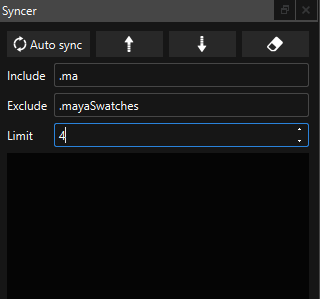 

### Panel de Notas 

Panel que recoge todas las notas que contenga la tarea seleccionada en el **"Panel de Tareas"**. Haga clic en una nota o imagen para abrirla en el navegador web. Adicionalmente, en la parte superior del panel se muestra la descripción de la tarea, si la tiene. 

### Panel de Versiones

Panel que recoge todas las versiones que contenga la tarea seleccionada en el **"Panel de Tareas"**.

### Panel de Renombrado

Herramienta de renombrado de archivos en lote. Para añadir o quitar archivos del lote que se va a procesar en la herramienta seleccione o deseleccione los archivos que desee en el panel del explorador de ficheros. 

  

* Prefix: añade el texto escrito en este campo al comienzo del nombre de todos los archivos seleccionados. 

* Suffix: añade el texto escrito en este campo al final del nombre de todos los archivos seleccionados. 

* Delete: elimina del nombre de los archivos seleccionados el texto escrito en el campo. 

* Replace: reemplaza del nombre de los archivos seleccionados el texto introducido en el campo de la izquierda por el texto introducido en el campo de la derecha. 

* Extension: reemplaza la extensión de los archivos seleccionados por la que se escribe en el campo. 

### Panel de Publicado 

Herramienta para publicar nuevas versiones en la base de datos del plugin. Adicionalmente trata de sincronizar los archivos locales con los del servidor, y si el plugin tiene habilitada la opción, da la posibilidad de empaquetar automaticamente los archivos seleccionados y subirlos a la base de datos. 

 

Existen dos formas de ejecutar la herramienta: 

* Para publicar archivos específicos de una tarea siga estos pasos: 

  * Antes de abrir la herramienta, seleccione los ficheros a publicar en el **"Panel de ficheros"**. 

  * Después abra la herramienta 

* Para publicar archivos de varias tareas siga estos pasos: 

  * Antes de abrir la herramienta, seleccione la tarea a publicar en el **"Panel de tareas"**. Después abra la herramienta. 

Una vez abierta la herramienta, se mostrarán los ficheros que se van a publicar. Esta herramienta muestra distintos campos de información: 

* En la parte superior se detalla la información de la tarea en la que se va a publicar los ficheros seleccionados. 

* Publish: checkbox para activar o desactivar la publicación de un fichero. Si la casilla está activa, el color del campo es azul y el archivo se publicará. Si la casilla está desactivada, el color del campo es blanco y el archivo no se publicará. 

* Status Publish: estado actual de la publicación del archivo.  

  * "Publish succesful" indica que el archivo ya ha sido publicado. **Los archivos publicados no se pueden volver a publicar.** 

  * "N/A" indica que el archivo no es compatible para ser publicado. 

  * "Not published" indica que el archivo no ha sido publicado anteriormente. 

* Status Sync: estado actual de la sincronización del archivo.  

  * "Not Synced" indica que el archivo no ha sido sincronizado en el servidor. 

  * "Sync succesful" indica que el archivo ya se encuentra sincronizado en el servidor. 

* Thumbnail: previsualización del archivo a publicar. 

* Path: nombre del archivo a publicar. 

* En la parte inferior añada la descripción que desee para su versión. 

* Presione el botón "Publish" para publicar. Al finalizar el proceso, la ventana se cerrará automáticamente. 

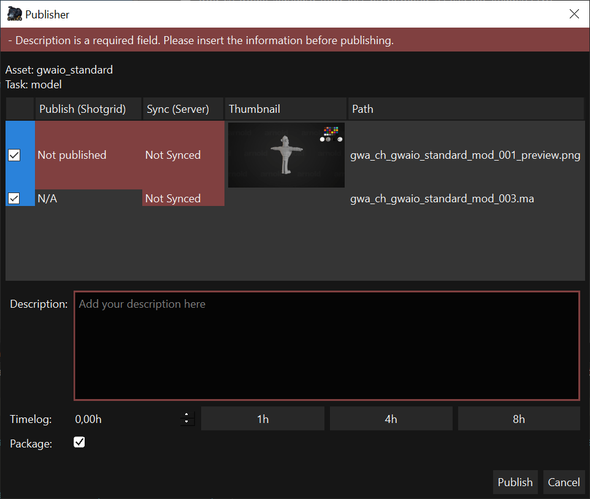 

Para que la publicación se pueda realizar, deberá rellenar toda la información necesaria, en caso de que falte información, la interfaz mostrará un borde de color rojo sobre el campo que requiera información.

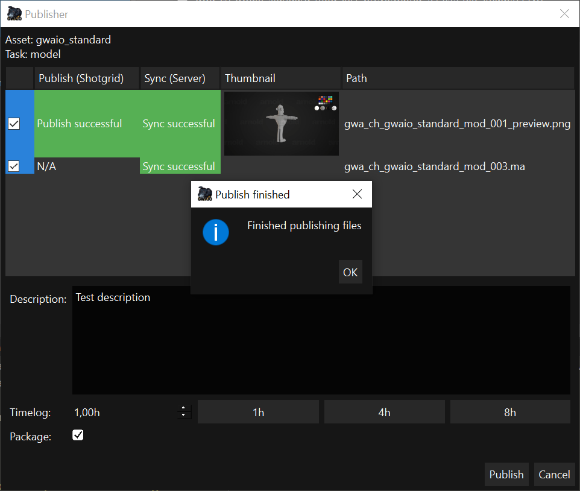 

Una vez finalizado el proceso de publicación, aparecerá una ventana que nos confirma que el proceso se ha realizado correctamente.

> **NOTA: esta herramienta requiere de acceso a su servidor y de conexión a internet para su correcto funcionamiento. Por favor, asegúrese de que cumple estos requisitos para su uso.**

> **NOTA: los archivos publicados en la base de datos no se pueden volver a publicar.**

### Panel de Concatenar (Obsoleto)

Herramienta para concatenar múltiples archivos multimedia en un único archivo de video. 

Para añadir los archivos con los que la herramienta va a trabajar, haga clic en uno de los tres métodos que se encuentran en la parte superior de la ventana. 

* Add Files from Folder: abre una ventana de selección de carpetas. Añade los archivos que contiene las carpetas seleccionadas en la anterior ventana. 

* Add Files from selected Task: añade todos los archivos que contenga la tarea seleccionada en el panel de Tareas. 

* Add Files from selected Files: añade todos los archivos seleccionados en el panel de explorador de ficheros. 

El panel central de la herramienta se compone de dos columnas. La primera muestra un checkbox para activar o desactivar su uso en el proceso de concatenado. Si el checkbox está activo en el archivo, la herramienta usara el fichero. En cambio, si el checkbox está desactivado, la herramienta omitirá el archivo durante el proceso de concatenado.  

La segunda columna del panel central de la herramienta muestra el nombre de los ficheros importados. 

En la parte inferior del panel encontramos dos opciones: 

* Duration image: seleccione los segundos que desee que dure las imágenes estáticas en el video concatenado. 

* Output video: inserte la ruta y nombre de la salida del video final. Haga clic en la carpeta para navegar por el explorador de archivos y seleccionar la carpeta de salida. 

Por último, presione el botón generar para empezar el proceso de creación del video. 

### Panel de BDL 

Herramienta para la creación por lotes de assets dada una BDL en Shotgrid. 

Este panel tiene 3 botones: 

* **Load XLSX:** te permite cargar un archivo xlsx que siga el patrón para el cual ha sido diseñado el plugin de proyecto. Cuando se carga la BDL, aparece una lista con los assets que se van a crear. 

  * 

  * Las filas en verde indican que ya han sido creados y que existen en la base de datos. 
  * 
  * Las filas en rojo indican que hay algún tipo de problema, haciendo doble clic en la fila, se indica que problema hay: 

 

  * Para subsanarlo se tiene que eliminar este fallo de la BDL (xlsx) y cargarlo de nuevo. 

* **Upload to SG:** sube los assets que no estén ni en rojo ni en verde a la base de datos. 

* **Upload selected to SG:** sube los assets seleccionados y que no estén ni en rojo ni en verde a la base de datos. 

> **Nota: Los assets que estén en verde y que se intenten subir actualizarán algunos datos, en el caso de que se aplique y en el case de que algunos datos no sean iguales en el XLSX y en la base de datos. Generalmente esto se aplica a la columna de Description.** 

### Panel de EDL 

Herramienta para la creación por lotes de shots en Shotgrid dado un fichero EDL. En esta ventana nos encontraremos 5 botones.

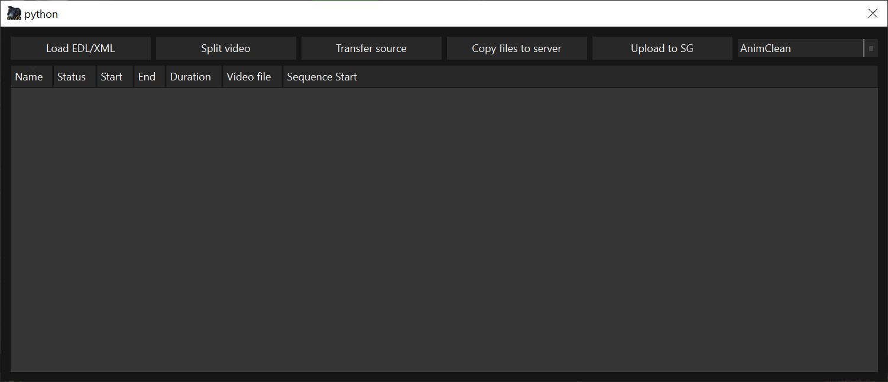

* **LOAD EDL/XML:** Este botón permite añadir los datos necesarios para poder trabajar con la herramienta:
  * 1.- Seleccione el archivo EDL.
  * 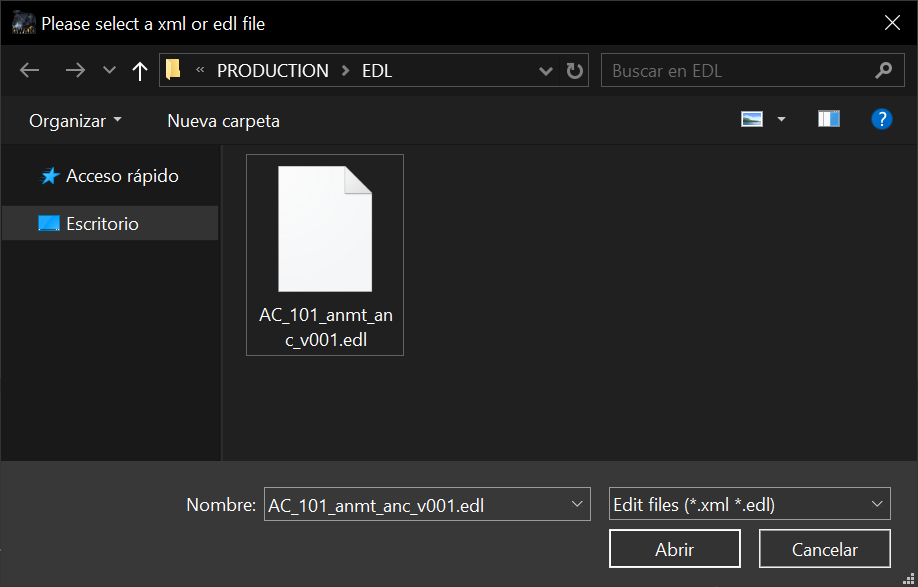
  * 2.- Seleccione el archivo de video correspondiente a la EDL.
  * 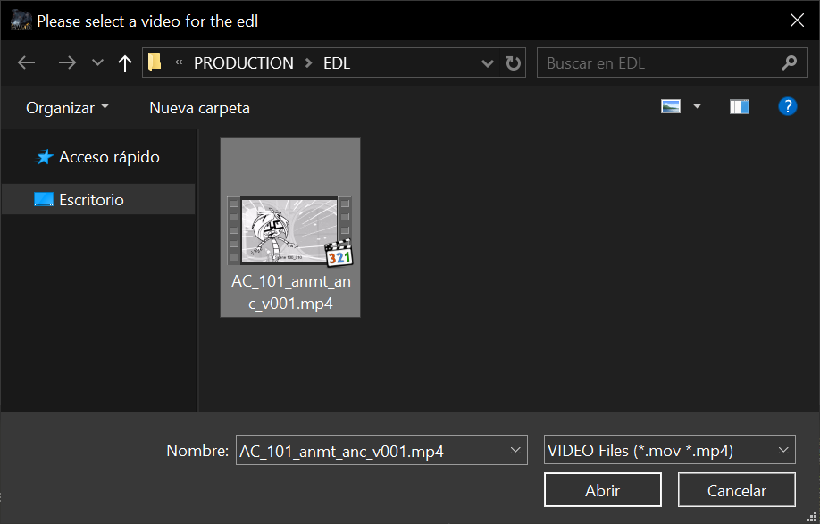
  * 3.- Seleccione el episode/sequence con la que quiere trabajar.
  * 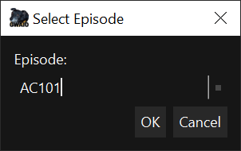
  * 4.- Seleccione la tarea en la que quiere trabajar.
  * 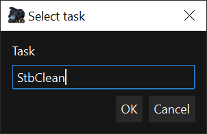
  * 5.- Una vez realizados todos los pasos tendremos la información en la ventana:
  * 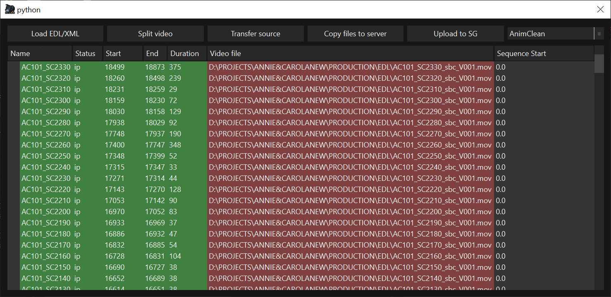
* **Split video:** Con los datos cargados, podemos utilizar esta botón para recortar los shots del video dado. A través de los datos de la EDL GwaIO recortará los shots seleccionados en la ventana y los guardará en formato mov y wav.
* **Copy files to server:** Copia los archivos generados con el **"Split video"** al servidor.
* **Upload to SG:** Genera los shots en Shotgrid si no existen y sube los videos recortados en la tarea seleccionada.

### Panel de Timelog 

Este panel sirve para marcar el timelog de la task seleccionada en Shotgrid.

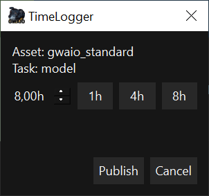

### Tool Download playlist version 

Herramienta para descargar los archivos de las versiones que contenga una Playlist de Shotgrid. 

1. Select Playlist: seleccione la playlist de la que quiere descargar las versiones. 

2. Output folder: seleccione la carpeta donde quiera guardar los archivos de la descarga. 

3. Generate edit with download files: seleccione esta opción si desea hacer un video concatenando todos los archivos descargados. 

4. Haga clic en el botón **"Download"** para comenzar el proceso 

### Tool Download Package

Ventana que nos muestra el listado de packages publicados en shotgrid. Esta ventana nos permite filtrar por nombre en caso de que deseemos un package en especifico. Esta herramienta nos descargará y ordenara en su ubicación correspondiente todos los archivos contenidos en el Package.

### Tool Job Manager (Experimental)

Herramienta en fase de desarrollo con la que gestionar los jobs que se envian miendiante la **"Toolbar de Jobs"**. En este panel encontraremos la información de cada uno de los jobs que tenemos en la farm nativa de GwaIO

Para acceder a esta herramienta haga clic en menu de la **"Barra de Menus"** View > Job Viewer

### Tool Broker (Experimental)

La herramienta de Broker simplemente se usa para activar el pc como un nodo de trabajo en la farm de GwaIO. Una vez activa la tool en el pc, comenzará a realizar las tareas que se encuentren en la **"Tool Job Manager"**.

Para acceder a esta herramienta haga clic en menu de la **"Barra de Menus"** View > Brocker Dock

### Toolbar de Jobs

Esta toolbar contiene botones con los que abrir el lanzador de jobs a la farm interna de GwaIO. Los componentes de esta toolbar dependerán del proyecto y de las necesidades que tenga.

### Tool Launch Job

Esta herramienta se abre mediante los botones que contiene la **"Toolbar de Jobs"**. Haga clic en el launcher deseado y a continuación se mostrara esta ventana:

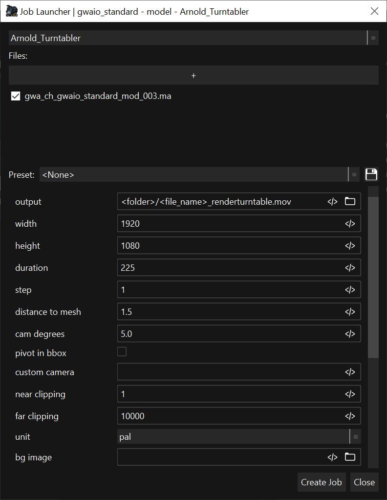

La herramienta de Launch Job se compone de una serie de opciones para poder configurar nuestro job:

 * Seleccione el tipo de job que desea lanzar a farm
 * Si es necesario, seleccione el archivo de input que requiere el job. Alternativamente, puede seleccionar el archivo en el **"Panel de explorardor"** previamente a abrir la herramienta.
 * Si lo desea, puede guardar un preset con la configuración del job para posteriormente poder seleccionar el preset deseado y no tener que configurar los valores a mano.
 * Configure las opciones con los parametros deseados.
   * Puede usar tags para automatizar el valor deseado en funcion a los valores de la tarea/proyecto. Por ejemplo, puede utilizar el tag de <cut_duration> para seleccionar el valor de duración que contiene la tarea.
   * Para ver el listado de tags haga clic en el botón de la derecha de cada opción.
   * Para previsualizar el resultado del tag mantenga el ratón sobre el boton de tags
   * Para ver la descripción de cualquier parametro mantenga el ratón sobre el cuadro de texto del valor del parametro.
 * Por último, haga clic en "Create Job" para lanzar el job a la farm.

## Buenas prácticas de uso 

Asegúrese de tener acceso a internet y a su servidor para el correcto funcionamiento del programa. En caso contrario, puede sufrir limitaciones de uso en las utilidades de GwaIO e incluso mal funcionamiento de algunas herramientas. 

### Comenzar una tarea nueva 

Cuando comience una tarea nueva, asegúrese de que dispone en su sistema local de la última versión que exista en el servidor. Para ello, seleccione la tarea correspondiente en el **"Panel de Tareas"** y haga clic en el botón **"Down task sync"** que se encuentra en la Toolbar de sincronizado.  

* Si al finalizar el proceso de sincronizado obtiene un fichero de versión, seleccione el archivo deseado y vaya a **"Barra de herramientas del explorador"** y haga clic en el botón -> **"Add version > From selected file"**. 

* Si al finalizar el proceso de sincronizado no obtiene ningún fichero de versión, vaya a la **"Barra de herramientas del explorador"** y haga clic en el botón -> **"Add version > From <"extensión"> file"** *(<"extensión"> es equivalente al formato del archivo de versión que desee)*. Realizando esta acción se asegurará de generar una versión base con la que empezar a trabajar a partir del último archivo generado en la tarea anterior. En caso de que no exista una versión previa o tarea previa, seleccione la "Template" idónea para su tarea en la ventana de selección que se abre cuando se da este caso. 

### Finalizar una tarea 

Al finalizar una tarea, asegúrese de sincronizar todos los archivos en su servidor y publicar la nueva versión correspondiente en Shotgrid. Para realizar esta acción de una manera idónea, se recomienda seguir estos pasos: 

1. Seleccione la tarea finalizada en el **"Panel de Tareas"**. 

2. Seleccione todos los archivos nuevos que desee sincronizar en el servidor y publicar en Shotgrid. 

3. Utilice la **"Panel de Publicado"** para publicar y sincronizar estos ficheros. 

4. Adicionalmente, puede sincronizar todos los ficheros en su servidor que no haya sincronizado en el **"Panel de Publicado"** haciendo clic en el botón **"Up task sync"**, que se encuentra en la **"Barra de sincronizado"**. Si únicamente desea sincronizar archivos específicos, seleccione los archivos específicos en el **"Panel de ficheros"** de y haga clic en **"Up sync file"**, que se encuentra en la **"Barra de sincronizado"**. 